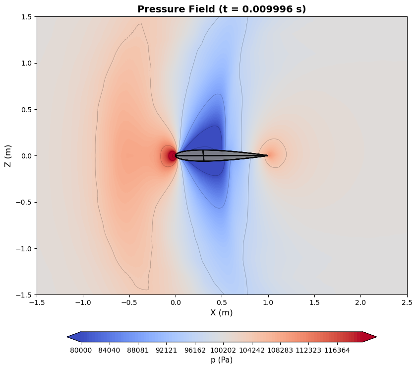
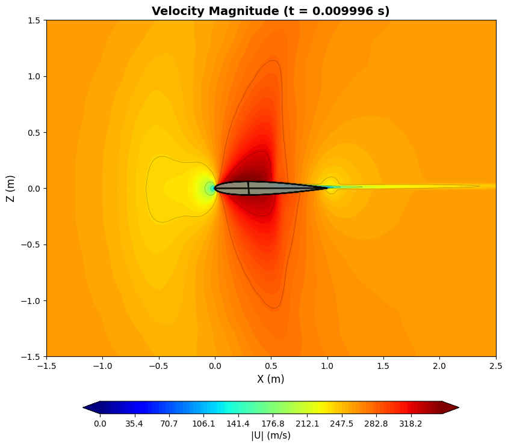

# NACA0012 翼型跨声速俯仰振荡模拟 (Ma=0.75)

本项目包含针对 NACA0012 翼型在跨声速流动条件下进行强迫俯仰振荡的 OpenFOAM 模拟案例。

## 📁 案例简介

* **案例名称**: Ma0.75omega42.5grid1
* **物理现象**: 跨声速流场 (Ma=0.75) 下的动态失速/气动弹性现象研究。
* **网格规模**: 2D 动网格 (~20,000 单元)

## ⚙️ 工况设置

### 流体属性 (空气 / 理想气体)
| 参数 | 值 | 说明 |
| :--- | :--- | :--- |
| 分子量 | 28.9 g/mol | |
| Cp | 1005 J/(kg·K) | 定压比热 |
| 动力粘度 ($\mu$) | 1.82×10⁻⁵ Pa·s | |
| Pr | 0.71 | 普朗特数 |
| $\gamma$ | 1.4 | 比热比 |

### 来流条件
* **马赫数 (Ma)**: 0.75
* **雷诺数 (Re)**: ~1.68×10⁷ (基于弦长 1m)
* **速度 ($U_\infty$)**: 261.3 m/s
* **静压 ($p_\infty$)**: 100,000 Pa
* **温度 ($T_\infty$)**: 298 K
* **参考密度 ($\rho_\infty$)**: ~1.169 kg/m³

### 运动参数 (俯仰振荡)
翼型绕 25% 弦长处 (0.25, 0, 0) 进行正弦俯仰运动。

* **运动类型**: `angularOscillatingDisplacement`
* **旋转轴**: Y轴 (0, 1, 0)
* **振幅 ($\alpha_0$)**: 0.0438 rad ($\approx 2.51^\circ$)
* **角频率 ($\omega$)**: 42.5 rad/s
* **减缩频率 ($k$)**: ~0.081
* **振荡周期 ($T$)**: ~0.148 s

## 💻 求解器配置

* **求解器**: `rhoPimpleFoam` (瞬态、可压缩、PIMPLE 算法)
* **湍流模型**: Spalart-Allmaras (RANS)
* **时间步长**: 自适应 ($\Delta t_{initial} = 2 \times 10^{-6}$ s, Max Co = 3.0)
* **模拟总时长**: 0.3 s (约 2 个振荡周期)

## 📊 结果可视化

以下展示了模拟过程中某一时刻（t ≈ 0.01s）的流场云图：

### 压力场 (Pressure)
下图展示了翼型周围的压力分布情况：

### 速度场 (Velocity U)
下图展示了翼型周围的速度量级分布：

---
*Generated based on simulation data from `Ma0.75omega42.5grid1_vis`.*
